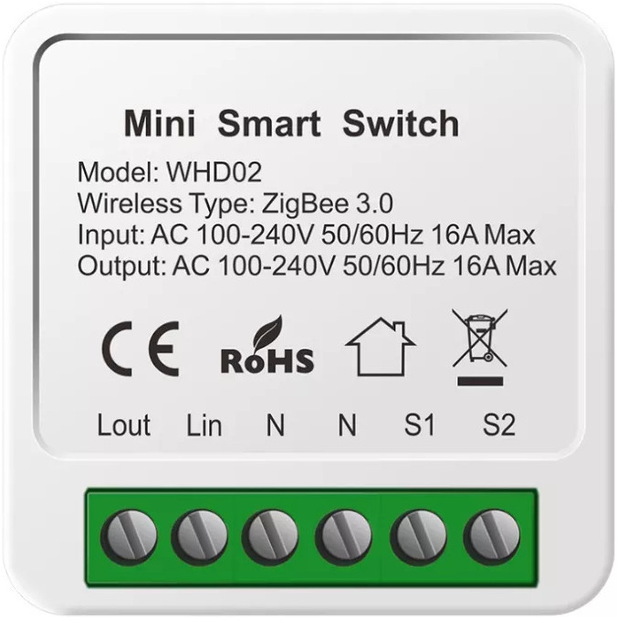

# wb-mqtt-zigbee

Сервис-мост между [zigbee2mqtt](https://www.zigbee2mqtt.io/) и [Wiren Board MQTT Conventions](https://github.com/wirenboard/conventions). Автоматически создает виртуальные WB-устройства для всех Zigbee-устройств, обнаруженных zigbee2mqtt.

## Как выглядит

### Устройство моста

Показывает состояние zigbee2mqtt: версию, количество устройств, управление сопряжением, логи и события.

### Zigbee-устройство

Каждое Zigbee-устройство отображается как виртуальное WB-устройство с контролами, соответствующими его возможностям. Контролы генерируются автоматически из `exposes`-схемы zigbee2mqtt.

  

## Возможности

- Автоматическое обнаружение и регистрация Zigbee-устройств (датчики, реле, лампы, кнопки)
- Двустороннее управление: переключатели, диммеры, цветные лампы (RGB) из WB UI
- Отслеживание доступности устройств (online/offline)
- Поддержка переименования и удаления устройств через zigbee2mqtt
- Устойчивость к перезапускам MQTT-брокера и zigbee2mqtt

## Документация

- [docs/arc42.md](docs/arc42.md) — архитектура (arc42)
- [docs/development-plan.md](docs/development-plan.md) — план разработки по этапам
- [docs/v1-analysis.md](docs/v1-analysis.md) — анализ предыдущей версии (JS/wb-rules)
