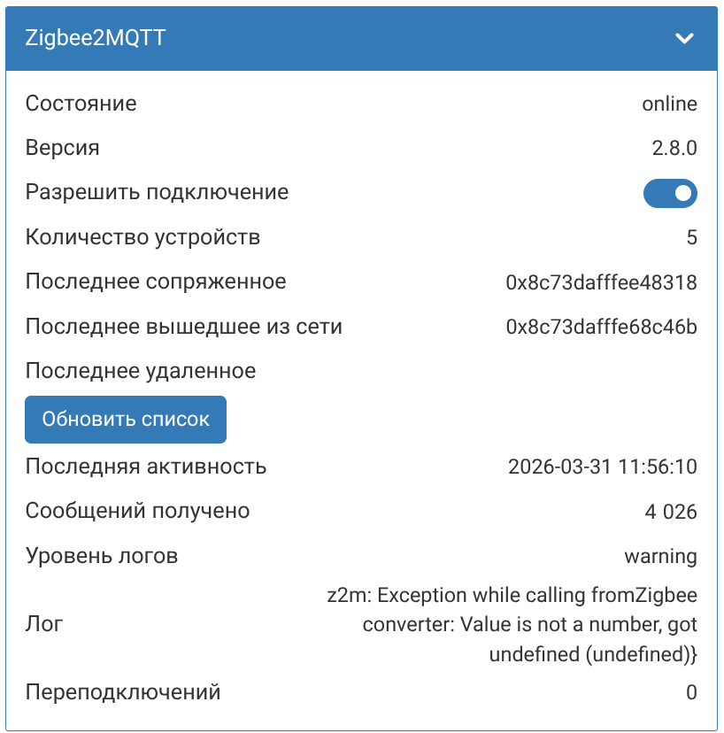
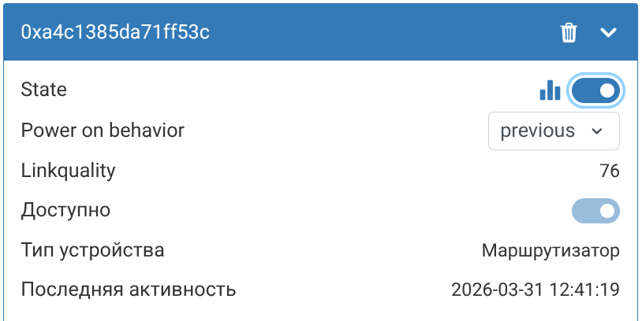
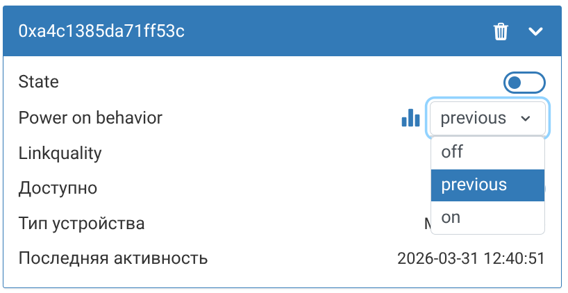

# Архитектура wb-mqtt-zigbee (arc42)

---

## 1. Введение и цели

### Назначение системы

`wb-mqtt-zigbee` — сервис-мост между [zigbee2mqtt](https://www.zigbee2mqtt.io/) и [Wiren Board MQTT Conventions](https://github.com/wirenboard/conventions). Создаёт виртуальные устройства WB на основе данных от zigbee2mqtt, транслирует состояния Zigbee-устройств в контролы WB, а команды пользователя из WB — обратно в zigbee2mqtt.

### Как выглядит в WB UI

  

### Цели

| Приоритет | Цель |
|---|---|
| 1 | Отображать все Zigbee-устройства как нативные WB-устройства |
| 2 | Поддерживать управление устройствами (не только чтение, как в v1) |
| 3 | Поддерживать OTA-обновление прошивок устройств |
| 4 | Корректно реагировать на удаление и переименование устройств в zigbee2mqtt |
| 5 | Поддерживать группы zigbee2mqtt |

### Стейкхолдеры

| Роль | Интерес |
|---|---|
| Пользователь Wiren Board | Видит Zigbee-устройства в WB UI, управляет ими, пишет правила wb-rules |
| Разработчик | Сопровождаемый, тестируемый Python-код вместо JS/wb-rules |
| Команда Wiren Board | Возможность распространять как deb-пакет, поддерживать как systemd-сервис |

---

## 2. Ограничения

### Технические

- Python 3.9
- `python3-wb-common (>= 2.1.0)` — единственная runtime-зависимость (включает paho-mqtt)
- Установка и запуск как systemd-сервис на устройствах Wiren Board
- Распространение как deb-пакет
- Совместимость с zigbee2mqtt v1.x и v2.x

### Организационные

- Конфигурация через JSON-файл `/usr/lib/wb-mqtt-zigbee/configs/wb-mqtt-zigbee.conf`
- Сборка через Jenkins (`buildDebArchAll`)

---

## 3. Контекст системы

### Внешние системы

```
             ┌─────────────────────┐
             │   Zigbee-устройства │
             │  (датчики, реле,    │
             │   лампы, ...)       │
             └──────────┬──────────┘
                        │ Zigbee (двунаправленно)
             ┌──────────▼──────────┐
             │     zigbee2mqtt     │
             │  (координатор Zigbee│
             │   + MQTT издатель)  │
             └──────────┬──────────┘
                        │ MQTT zigbee2mqtt/* (двунаправленно)
             ┌──────────▼──────────┐
             │  Mosquitto брокер   │
             └──────────┬──────────┘
                        │ MQTT /devices/* (двунаправленно)
         ┌──────────────┼──────────────────┐
         │              │                  │
┌────────▼────────┐  ┌──▼─────────────┐  ┌▼─────────────┐
│ wb-mqtt-zigbee  │  │ wb-mqtt-serial │  │ Wiren Board  │
│   -v2 (это)     │  │ (другие        │  │   Web UI     │
│  R: zigbee2mqtt/│  │  устройства WB)│  │  (только     │
│  W: /devices/   │  └────────────────┘  │   чтение)    │
└─────────────────┘                      └──────────────┘
```

### MQTT-топики: вход (от zigbee2mqtt)

| Топик | Содержимое |
|---|---|
| `zigbee2mqtt/bridge/state` | Состояние моста (`online`/`offline`) |
| `zigbee2mqtt/bridge/info` | Версия, permit_join |
| `zigbee2mqtt/bridge/logging` | Лог-сообщения |
| `zigbee2mqtt/bridge/devices` | Список устройств с `exposes`-схемой (retained) |
| `zigbee2mqtt/bridge/event` | События: `device_joined`, `device_leave`, `device_renamed` |
| `zigbee2mqtt/bridge/response/device/remove` | Ответ на команду удаления устройства |
| `zigbee2mqtt/{device_name}` | Состояние устройства |
| `zigbee2mqtt/{device_name}/availability` | Доступность устройства (`{"state":"online"}` / `{"state":"offline"}`) |

### MQTT-топики: выход (команды в zigbee2mqtt)

| Топик | Команда |
|---|---|
| re-subscribe `zigbee2mqtt/bridge/devices` | Получить актуальный retained-список устройств (z2m 2.x не поддерживает `bridge/request/devices/get`) |
| `zigbee2mqtt/bridge/request/permit_join` | Включить/выключить сопряжение |
| `zigbee2mqtt/{device_name}/set` | Отправить команду устройству |
| `zigbee2mqtt/{device_name}/get` | Запросить текущее состояние устройства |

---

## 4. Стратегия решения

- **Динамическое построение контролов из `exposes`** вместо захардкоженных маппингов v1. Это автоматически даёт поддержку управления и новых типов устройств без изменения кода. Отображаемое имя контрола генерируется из имени property: `noise_detect_level` → `"Noise detect level"`.
- **Поддержка цветных ламп**: composite expose `color` (color_xy / color_hs) маппится в единый WB-контрол типа `rgb`. z2m всегда отдаёт оба представления цвета (`hue`/`saturation` и `x`/`y`), используем HS→RGB через `colorsys.hsv_to_rgb()`. Результат — WB формат `"R;G;B"`, homeui показывает color picker. Brightness выделен в отдельный контрол (V=1.0 в HSV).
- **Сервисные контролы устройств**: к каждому устройству автоматически добавляются контролы `available` (онлайн/офлайн статус), `device_type` (тип в z2m сети: Router/EndDevice/Coordinator с русской локализацией) и `last_seen` (время последней активности, конвертация из epoch/ISO в локальное время).
- **Event-driven внутри сервиса**: `z2m/client.py` парсит входящие MQTT-сообщения и генерирует события, `bridge.py` реагирует на них и вызывает `wb_converter/publisher.py`. Обратный путь: `publisher.py` подписывается на `/on`-топики WB, команды через callback передаются в `bridge.py`, который публикует в z2m.
- **Минимум зависимостей**: только `paho-mqtt`, никаких фреймворков.

---

## 5. Структура системы (Building Blocks)

### Уровень 1

```
┌──────────────────────────────────────────────┐
│              wb-mqtt-zigbee                  │
│                                              │
│  main.py → app.py (WbZigbee2Mqtt)            │
│                    │                         │
│              bridge.py (оркестратор)         │
│              ┌─────┴─────┐                   │
│        ┌─────┴──┐  ┌─────┴───────┐           │
│        │  z2m/  │  │wb_converter/│           │
│        └────────┘  └─────────────┘           │
│              wb_common.MQTTClient            │
└──────────────────────────────────────────────┘
```

### Уровень 2 — модули

| Модуль | Ответственность |
|---|---|
| `main.py` | Точка входа: `setup_logging()`, парсинг CLI, загрузка конфига |
| `app.py` | `WbZigbee2Mqtt`: MQTT-клиент, сигналы, жизненный цикл, коды выхода |
| `config_loader.py` | Загрузка и валидация JSON-конфига (dataclass `ConfigLoader`) |
| `bridge.py` | Оркестратор: z2m-события → WB-контролы, регистрация/удаление устройств |
| `registered_device.py` | `RegisteredDevice`: кеш z2m-устройства с WB controls и device_id |
| `z2m/client.py` | `Z2MClient`: подписка на z2m-топики, парсинг → коллбэки |
| `z2m/model.py` | `BridgeInfo`, `BridgeState`, `DeviceEvent`, `BridgeLogLevel`, `Z2MDevice`, `ExposeFeature`, `ExposeType`, `ExposeProperty` |
| `wb_converter/publisher.py` | `WbMqttDriver`: публикация/удаление устройств, JSON `/meta`, команды |
| `wb_converter/expose_mapper.py` | Маппинг z2m exposes → WB `ControlMeta` (12 numeric типов, binary, enum, text, range для writable с min/max) |
| `wb_converter/controls.py` | `WbControlType` (16 констант, вкл. RANGE, RGB), `BridgeControl`, `ControlMeta` (с `format_value`, `parse_wb_value` и HS↔RGB), `BRIDGE_CONTROLS` |

---

## 6. Динамика (Runtime View)

### Старт сервиса

```
main.py
  → загружает wb-mqtt-zigbee.conf (JSON)
  → создаёт WbZigbee2Mqtt (app.py)
    → создаёт MQTTClient, Bridge
    → подключается к брокеру

on_connect (первое подключение):
  → bridge.subscribe()
    → публикует WB-устройство моста (meta + начальные значения 12 контролов)
    → z2m_client подписывается на 6 топиков (state, info, logging, devices, event, response/device/remove)
    → подписывается на WB-команды (permit_join, update_devices)

on_connect (реконнект):
  → bridge.republish()
    → перепубликует meta и контролы моста
    → выставляет available=offline для всех устройств
    → сбрасывает availability_received для восстановления fallback
    → re-subscribe на z2m топики, запрашивает state устройств
    → инкрементирует счётчик Reconnects
```

### Обновление состояния устройства

#### Идентификация устройств: `friendly_name` как `device_id`

WB `device_id` формируется из `friendly_name` (sanitized: спецсимволы заменяются на `_`). Уникальность `friendly_name` гарантируется zigbee2mqtt.

Это обеспечивает совместимость с v1 (wb-rules), который также использовал `friendly_name` как device_id, и позволяет пользователям видеть понятные имена в MQTT-топиках.

При переименовании устройства в z2m `device_id` меняется — старое WB-устройство удаляется, новое создаётся. `ieee_address` используется внутри для обнаружения переименования (по индексу `_ieee_to_name`).

```
zigbee2mqtt/{friendly_name} (входящее сообщение)
  → z2m/client.py парсит JSON
  → bridge.py получает событие device_state_changed
  → wb_converter/publisher.py публикует /devices/{friendly_name}/controls/{control}
```

### Команда из WB

По WB MQTT Conventions топик `/on` — это канал для входящих команд:
сервис подписывается на него и реагирует на действия пользователя (веб-интерфейс, другой клиент).
Задача сервиса — получить команду из `/on`-топика и транслировать её в соответствующий топик zigbee2mqtt.

```
/devices/{friendly_name}/controls/{control}/on (входящее сообщение от пользователя)
  → publisher.py получает команду через /on-подписку
  → bridge.py маппит WB-контрол → z2m атрибут
  → mqtt_client публикует zigbee2mqtt/{friendly_name}/set {"attribute": value}
```

### Удаление устройства

Обрабатывается двумя способами:

1. Событие `bridge/event` с `type: "device_leave"` — устройство покинуло сеть
2. Ответ `bridge/response/device/remove` — пользователь удалил устройство через z2m

```
zigbee2mqtt/bridge/event → {"type": "device_leave", ...}
или
zigbee2mqtt/bridge/response/device/remove → {"status": "ok", "data": {"id": "..."}}
  → bridge.py удаляет устройство из _known_devices
  → z2m/client.py (unsubscribe_device) снимает подписку с zigbee2mqtt/{friendly_name}
  → wb_converter/publisher.py (remove_device) публикует пустые retain "" на все топики WB-устройства
  → устройство исчезает из WB UI
```

### Очистка stale и ghost устройств

Устройства могут "застрять" в MQTT-брокере как retain-сообщения в двух сценариях:

1. **Stale-устройства** — устройство исчезло из `bridge/devices`, пока сервис работал (например, z2m перезапустился и потерял устройство). Обнаруживаются при каждом обновлении `bridge/devices`: сравниваются `_known_devices` с актуальным списком, лишние удаляются.

2. **Ghost-устройства** — retained-топики от предыдущего запуска сервиса. Сервис стартует с пустым `_known_devices` и не знает о них.

#### Механизм обнаружения ghost-устройств

Каждое WB-устройство публикуется с маркером `"driver": "wb-zigbee2mqtt"` в JSON `/devices/{id}/meta`. При старте сервис:

1. Подписывается на wildcard-топики `/devices/+/meta` и `/devices/+/controls/+/meta`
2. Собирает `device_id` устройств с нашим driver и их control_id
3. При первом `bridge/devices` от z2m — сравнивает найденные device_id с актуальными
4. Для ghost-устройств (есть в retained, нет в z2m) публикует пустые retain на все их топики
5. Отписывается от wildcard-топиков (сканирование одноразовое)

Маркер `driver` гарантирует, что сервис не удалит устройства других драйверов (wb-mqtt-serial, wb-modbus и т.д.).

### Переименование устройства

Обрабатывается двумя способами (z2m может использовать любой):

1. Событие `bridge/event` с `type: "device_renamed"` — содержит `from` и `to`
2. Переопубликация `bridge/devices` — `_register_device` обнаруживает, что `ieee_address` уже известен под другим `friendly_name`

```
zigbee2mqtt/bridge/devices → устройство с новым friendly_name
  → bridge.py находит старое имя по ieee_address (_find_old_name)
  → z2m/client.py (unsubscribe_device) снимает подписку со старого топика
  → wb_converter/publisher.py (remove_device) удаляет старое WB-устройство
  → wb_converter/publisher.py (publish_device) создаёт новое WB-устройство с новым device_id
  → z2m/client.py (subscribe_device) подписывается на новый топик
```

### Обновление метаданных и контролов зарегистрированных устройств

При повторном получении `bridge/devices` (автоматически или по кнопке «Обновить устройства») для уже зарегистрированных устройств:

- Обновляется служебный контрол `device_type`
- Если набор exposes изменился (например, после OTA-обновления прошивки) — контролы перерегистрируются: старые удаляются, новые публикуются, подписки обновляются

### Валидация MQTT-топиков

Имена устройств (`friendly_name`) используются как сегменты MQTT-топиков. Для защиты от подписки на wildcard-топики проверяется отсутствие символов `+` и `#` в `friendly_name`. Устройства с небезопасными именами пропускаются с предупреждением в лог.

### Устойчивость к ошибкам

При парсинге списка устройств из `bridge/devices` ошибка в одном устройстве (невалидный JSON, отсутствие полей) не блокирует обработку остальных. Ошибка логируется, остальные устройства регистрируются нормально.

### Debounce команд (optimistic update)

Zigbee-устройства обрабатывают команды с задержкой (сотни миллисекунд). В это время z2m продолжает публиковать старое состояние, что вызывает "мерцание" значений в WB UI и зацикливание в wb-rules.

Решение — optimistic update с debounce:

1. При отправке команды сразу публикуем commanded value в WB MQTT
2. Входящие state updates от z2m для этого контрола подавляются на время debounce
3. Если z2m подтверждает commanded value — pending очищается немедленно
4. Если debounce истёк, а z2m прислал другое значение — публикуем реальное (откат)

Таймаут настраивается через `command_debounce_sec` в конфиге (по умолчанию 5 секунд). Readonly контролы (датчики) не затрагиваются.

### Доступность устройств (availability)

Каждое устройство получает сервисный контрол `available` (switch, readonly). Источники данных:

1. **z2m availability** — подписка на `zigbee2mqtt/{device}/availability`, парсинг `{"state":"online"/"offline"}`. Требует включённой секции `availability` в конфиге z2m (добавляется автоматически в `postinst`).
2. **Fallback по state** — если от устройства приходят данные состояния, но `availability` ещё не приходил (`availability_received = False`), устройство считается online. Это покрывает случай потери retained availability после рестарта mosquitto.

При отключении от брокера (`on_disconnect`) все устройства помечаются как offline (`set_all_unavailable`). При реконнекте (`republish`) устройства регистрируются с `available=offline`, `availability_received` сбрасывается в `False` для восстановления fallback.

### Зависимость от retained `bridge/devices`

Список устройств z2m публикуется в `zigbee2mqtt/bridge/devices` как retained-сообщение **один раз при старте z2m**. Если mosquitto перезапускается без persistence (по умолчанию на WB), retained теряется. z2m 2.x **не поддерживает** `bridge/request/devices` — запрос игнорируется.

Последствия: после рестарта mosquitto (без рестарта z2m) наш сервис не получает `bridge/devices` → устройства не регистрируются → управление не работает.

**Рекомендация**: добавить `BindsTo=mosquitto.service` в systemd-юнит `zigbee2mqtt.service`, чтобы z2m автоматически перезапускался вместе с mosquitto и переопубликовал retained-топики.

### Известные ограничения

- Устройства, у которых все exposes неизвестного типа, не регистрируются (только `last_seen` недостаточно)
- OTA-обновление прошивок через WB UI не реализовано (зарезервировано в `z2m/ota.py`)
- Группы zigbee2mqtt не поддерживаются
- EndDevice (спящие устройства) не отвечают на `get`-запросы — availability восстанавливается только когда устройство просыпается и отправляет данные

---

## 7. Развёртывание (Deployment View)

```
Wiren Board (ARM Linux)
├── /usr/lib/python3/dist-packages/wb/mqtt_zigbee/        — Python-пакет
├── /usr/lib/wb-mqtt-zigbee/configs/wb-mqtt-zigbee.conf   — конфигурация (JSON)
└── /lib/systemd/system/wb-mqtt-zigbee.service            — systemd unit

Зависимости на целевой системе:
- python3.9
- python3-wb-common (>= 2.1.0) — включает paho-mqtt
- MQTT broker (mosquitto, уже установлен на WB)
- zigbee2mqtt (устанавливается отдельно)
```

### Миграция с v1 (wb-rules)

#### Совместимость имён

WB `device_id` формируется из `friendly_name` (sanitized) — то же поле, которое v1 (wb-rules) использовал для именования устройств. Это обеспечивает совместимость: если пользователь не менял имена устройств в z2m, его wb-rules правила продолжат работать без изменений.

Имена контролов строятся из `property` в exposes — для стандартных устройств они совпадают с v1 (`state`, `temperature`, `humidity` и т.д.).

#### Удаление старого пакета

- `debian/control`: `Conflicts: wb-zigbee2mqtt` + `Replaces: wb-zigbee2mqtt` — dpkg автоматически удаляет старый пакет при установке нового
- `postinst`: удаляет переименованные пользователем скрипты v1 (`wb-zigbee2mqtt.js*`), которые не входят в пакет и не удаляются dpkg

#### Очистка MQTT

При первом запуске ghost cleanup обнаруживает retained-топики с `driver: wb-zigbee2mqtt` и удаляет устройства, которых нет в текущем списке z2m. Это очищает мусор от v1 без ручного вмешательства.

---

## 8. Сквозные концепции (Cross-cutting Concepts)

### Переподключение к MQTT

`wb_common.MQTTClient` реализует автоматическое переподключение при разрыве. После восстановления соединения `app.py` вызывает `bridge.republish()` для перепубликации meta и контролов моста. Подписки MQTT-клиент восстанавливает автоматически.

### Динамические контролы WB

WB MQTT Conventions позволяют добавлять и удалять контролы в runtime через retain-сообщения на мета-топики. Это используется для:
- создания контролов при обнаружении устройства
- перерегистрации контролов при изменении exposes
- удаления всех контролов при удалении устройства

### Совместимость z2m v1.x / v2.x

Версия z2m определяется из `bridge/info`. Permit join использует формат `{"time": N}`, совместимый с z2m 1.21+ и v2.x.

### Логирование

Используется стандартный `logging` Python. В systemd-окружении вывод идёт в journald (`journalctl -u wb-mqtt-zigbee`).

---

## 9. Архитектурные решения

| Решение | Обоснование |
|---|---|
| Python 3.9 вместо JS/wb-rules | Тестируемость, читаемость, независимость от движка wb-rules |
| paho-mqtt без фреймворков | Минимум зависимостей, контроль над логикой переподключения |
| `exposes` вместо захардкоженных маппингов | Автоматическая поддержка новых устройств и writable-контролов |
| systemd-сервис | Стандартный способ управления сервисами на WB |
| Один MQTT-клиент для z2m и WB | Оба брокера — один и тот же mosquitto на WB |

---

## 10. Требования к качеству

| Атрибут | Требование |
|---|---|
| Надёжность | Автоматическое восстановление после потери MQTT-соединения |
| Актуальность данных | Состояние устройств запрашивается через `/get` при старте, далее — в реальном времени |
| Сопровождаемость | Покрытие тестами, статический анализ (pylint), автоформатирование (black, isort) |
| Совместимость | Работа с zigbee2mqtt v1.x и v2.x |

---

## 11. Риски и технический долг

| Риск | Описание | Митигация |
|---|---|---|
| Сложность `exposes` | Вложенные composite/specific features могут давать неожиданные структуры | Итеративная разработка на реальных устройствах |
| Миграция с v1 | Имена контролов могут отличаться для нестандартных устройств | `friendly_name` как device_id обеспечивает совместимость имён устройств; имена контролов из exposes совпадают для большинства устройств |
| Группы без `exposes` | У групп нет схемы — используется фиксированный набор контролов | Можно расширить позже |

---

## 12. Глоссарий

| Термин | Определение |
|---|---|
| **zigbee2mqtt** | Open-source шлюз, который подключает Zigbee-устройства к MQTT-брокеру |
| **WB MQTT Conventions** | Соглашение Wiren Board о структуре MQTT-топиков для устройств и контролов |
| **exposes** | Схема, которую zigbee2mqtt публикует для каждого устройства: список атрибутов, типы, права доступа |
| **wb-rules** | Движок правил Wiren Board, выполняет JS-скрипты для автоматизации |
| **контрол** | Единица данных в WB MQTT Conventions: одно значение с типом, единицей измерения и правами доступа |
| **retain** | Флаг MQTT-сообщения: брокер хранит последнее значение и отдаёт новым подписчикам сразу |
| **OTA** | Over-the-air — обновление прошивки устройства по воздуху через zigbee2mqtt |
